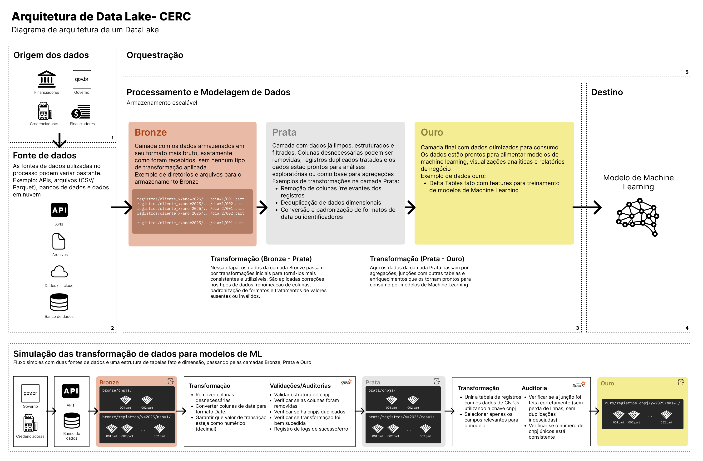
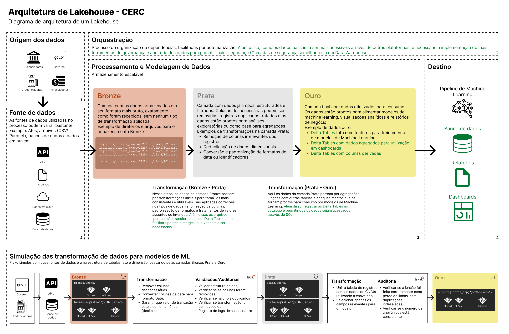

# Processo Seletivo Engenheiro de Dados

## Primeira etapa

O repositório `primeira_etapa/` contém os scripts do problema, elaborado no conjunto de dados `chicago.csv`. O conjunto de dados não foi disponibilizado diretamente através do github por conta do tamanho do arquivo. Portanto, ele precisa ser solicitado, baixado e inserido no diretório de execução do código para que seja possível reproduzir esse processo.

- `primeira_etapa/chicago_bikeshare_pt.py`
- `primeira_etapa/script_original/chicago_bikeshare_pt.py`

Além disso, o script original, sem alterações, pode ser encontrado do diretório `script_original/`

Observações:
- As funções seguem o padrão de [Numpy Docstring](https://numpydoc.readthedocs.io/en/latest/format.html#docstring-standard) 
- O código foi desenvolvido e testado utilizando Python 3.12.
- As Tarefas 6 e 7 geram gráficos em janelas separadas. Para que o script continue sua execução, é necessário fechar as janelas abertas.

### Como executar o código

1. Baixe o arquivo `chicago.csv` (Para ter acesso, faça uma solicitação)
2. Certifique-se de que o arquivo `chicago.csv` está no mesmo diretório que o script `chicago_bikeshare_pt.py`.
3. Execute o script com o seguinte comando: `python primeira_etapa/chicago_bikeshare_pt.py`

## Segunda etapa

Esta etapa propõe a elaboração de um desenho arquitetural para um Data Lake

A construção de um Data Lake exige um entendimento claro sobre a origem, características e destino dos dados. Neste projeto, foi definido um cenário com as seguintes características principais:
- O contexto envolve dados de recebíveis, originados de credenciadoras, comércios, órgãos governamentais, entre outros.
- Os dados serão utilizados principalmente para o treinamento de modelos de Machine Learning.
- A ingestão dos dados ocorrerá em lotes (batch), e não via streaming.

Uma arquitetura mais robusta e genérica, capaz de escalar para diferentes cenários, será apresentada ao final, após a análise de pontos fortes e fracos da abordagem.

###  Perguntas-Chave para Estruturação

Antes de desenhar a arquitetura, é essencial levantar informações estratégicas sobre as fontes e os objetivos dos dados. A tabela a seguir traz um conjunto de perguntas iniciais, com exemplos preenchidos para contextualizar o cenário simulado:

| Perguntas| Exemplo | 
| - | - |
| Quem utilizará nossos dados? | Time de cientista de dados |
| Como nossos dados serão utilizados? | Para treinamento e validação de modelos de Machine Learning |
| Qual volume dos dados de entrada? | 	Alto volume (estimativa incerta) |
| Qual formato dos dados de entrada? | Dados estruturados, semi-estruturados ou não estruturados |
| Qual frequência dos dados? | Por hora ou por dia (estimativa incerta) |
| Como esses dados serão armazenados? | Os dados serão armazenados no formato de arquivos .parquet |
| Qual destino dos dados tratados? | Data Lake (Camadas Prata e Ouro) |
| Como esses dados serão consumidos? | Diretamente a partir da Camada Gold do Data Lake|

## Desenho de arquitetura de Data Lake

### 1 Origem dos dados

Os dados têm múltiplas origens, incluindo credenciadoras, instituições financeiras, investidores e fontes públicas disponibilizadas por órgãos governamentais. Essas diferentes fontes refletem a diversidade e complexidade do ecossistema de dados a ser integrado.

### 2 Fonte de de dados

As fontes podem se apresentar em diferentes formatos e canais, como:
- APIs (interfaces de serviços externos),
- Arquivos CSV
- Buckets armazenados em ambientes de nuvem (ex: AWS S3, GCP, Azure Blob Storage).

### 3. Processamento e Modelagem de dados

O pipeline de dados é baseado na arquitetura em camadas (medalhão), composta por três estágios principais:

- Camada Bronze: Responsável por realizar o staging dos dados brutos, armazenando-os de forma íntegra e sem modificações.
- Camada Prata: Realiza transformações, padronizações, validações e enriquecimentos dos dados, preparando-os para análises mais complexas.
- Camada Ouro: Agrega os dados tratados e entrega-os em um formato otimizado para consumo analítico e modelagem.

Durante as transformações entre camadas, aplica-se o padrão Write-Audit-Publish, que garante rastreabilidade, validação e qualidade dos dados em cada etapa do processo.

### 4. Consumo dos dados

O consumo é realizado prioritariamente a partir da Camada Ouro, onde os dados já estão preparados e otimizados para uso por cientistas de dados e analistas. Em casos específicos, dados da Camada Prata podem ser acessados para análises exploratórias ou intermediárias.

### 5. Orquestração dos dados

A orquestração compreende a gestão de todas as etapas do pipeline, garantindo que as tarefas sejam executadas na ordem correta e no tempo esperado. Essa automação permite controlar dependências, lidar com falhas e garantir a entrega confiável dos dados. O objetivo principal da orquestração é assegurar que os dados estejam sempre atualizados, íntegros e prontos para consumo.

## Pontos fortes x pontos fracos

### Pontos fortes
1. Flexibilidade para trabalhar com dados estruturados, semi-estruturados e não estruturados.
2. Custo de armazenamento baixo
3. Escalabilidade simples e eficiente.

### Pontos Fracos
1. Alta complexidade em governança e garantia de qualidade dos dados, devido à ausência de schema por padrão.
2. Desempenho inferior para análises típicas de BI.
3. Arquitetura focada quase exclusivamente no treinamento de modelos de Machine Learning.

## Desenho de arquitetura de Lakehouse

Para cenários em que há maior colaboração entre diferentes times — como cientistas de dados, analistas e engenheiros de software — uma evolução natural do Data Lake é o Lakehouse. Essa abordagem combina a flexibilidade e escalabilidade dos Data Lakes com as funcionalidades de transação, governança e performance dos Data Warehouses.
Retomando as perguntas fundamentais sob a ótica do novo modelo:

| Perguntas| Exemplo | 
| - | - |
| Quem utilizará nossos dados? | Time de cientista de dados, analistas de dados e desenvolvedores de software |
| Como nossos dados serão utilizados? | Os dados serão utilizados para treinamento de modelos de Machine Learning, geração de relatórios e consumo por ferramentas de BI |
| Qual volume dos dados de entrada? | Alto volume (estimativa incerta) |
| Qual formato dos dados de entrada? | Dados estruturados, semi-estruturados ou não estruturados |
| Qual frequência dos dados? | Por hora ou por dia (estimativa incerta)|
| Como esses dados serão armazenados? | Os dados serão armazenados no formato de arquivos .parquet como Delta Tables|
| Qual destino dos dados tratados? | Data Lake (Camadas Prata e Ouro) e Bancos de dados (Construídos em databricks SQL, por exemplo)|
| Como esses dados serão consumidos? | Diretamente do Data Lake (Camada Gold) ou consumidos através de conectores do Databricks de Delta Table gerados na camada gold|

Ao adotar o modelo Lakehouse, a empresa ganha uma arquitetura mais robusta, adaptável a diferentes contextos de negócio. Isso é especialmente útil em empresas com grandes volumes de dados, onde múltiplos times precisam extrair insights a partir de uma mesma base de dados com governança e segurança adequadas.

A transformação de um Data Lake em um Lakehouse exige etapas adicionais — especialmente em relação à orquestração e segurança. Isso inclui controle refinado de permissões, versionamento, controle de acesso a tabelas e integração com sistemas de BI. Por simplicidade, esses aspectos não são abordados em detalhes neste documento.

## Ferramentas utilizadas:

Para o código:
- Python

Para geração dos desenhos:
- Figma

## Referências

- Principal referência: Matt Palmer, Understanding ETL Data Pipelines for Modern Data Architectures, 2024 (1st edition)
- [Documentação CERC](https://www.cerc.com/documentos/) 
- [MongoDB - Data Lake Architecures](https://www.mongodb.com/resources/basics/databases/data-lake-architecture)
- [Recebíveis de cartões - CERC](https://conteudo.cerc.inf.br/recebiveis-de-cartoes-cerc)
